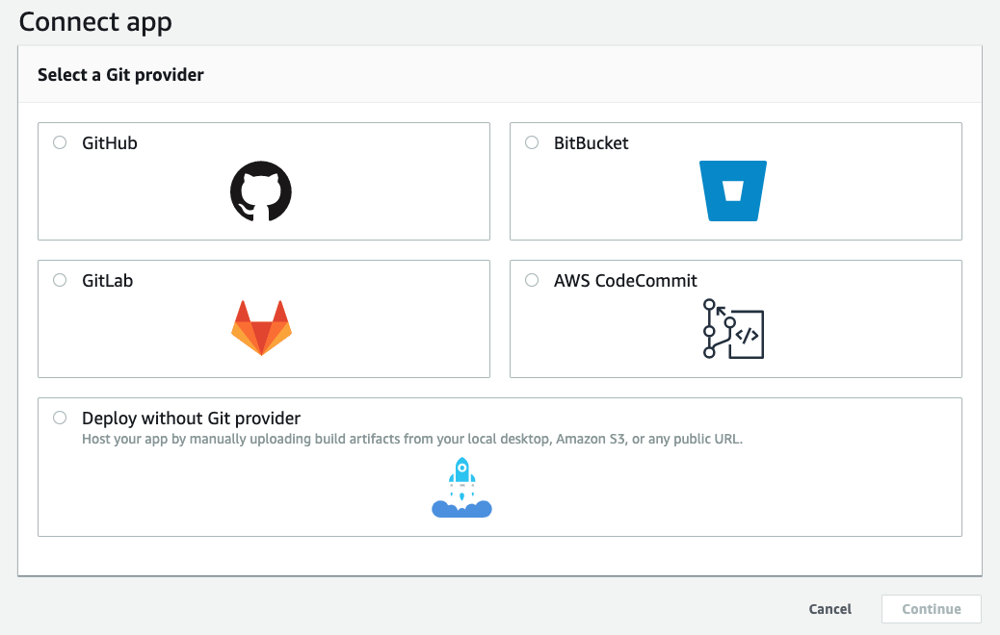
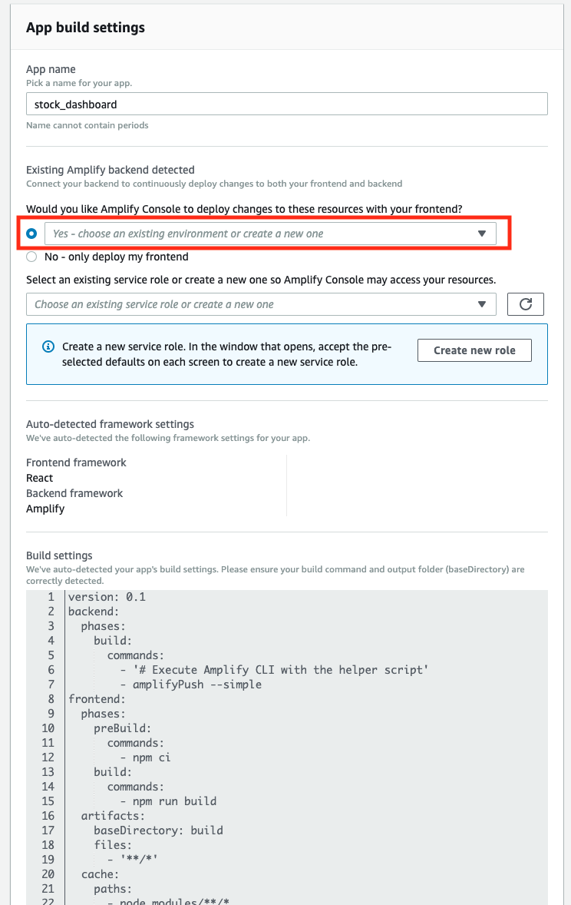
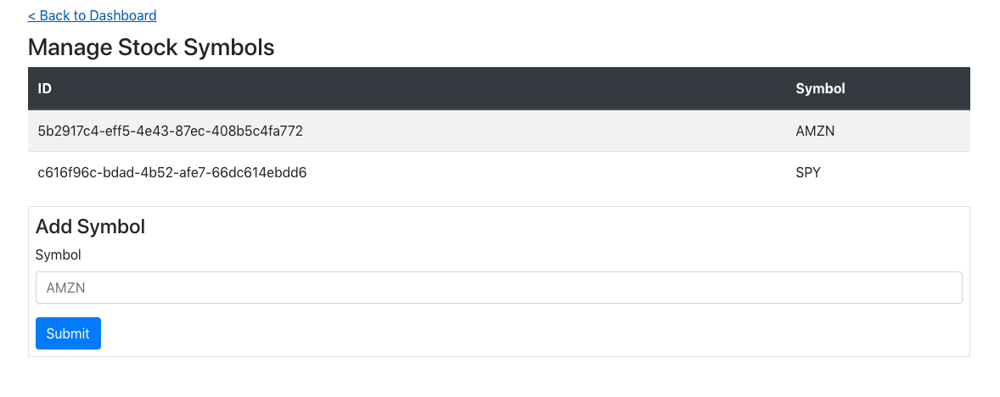
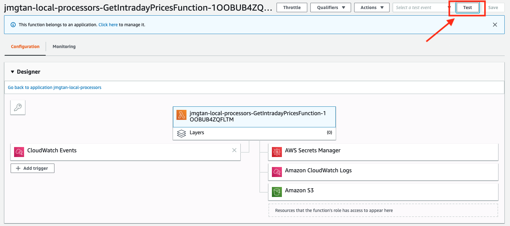
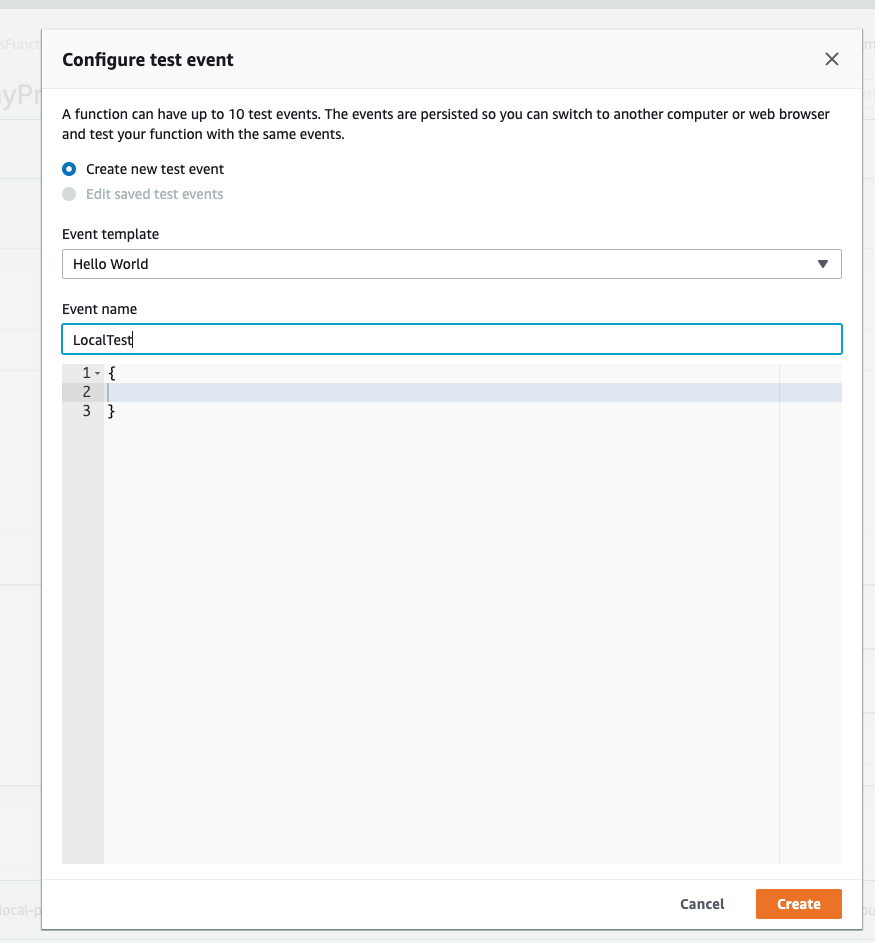
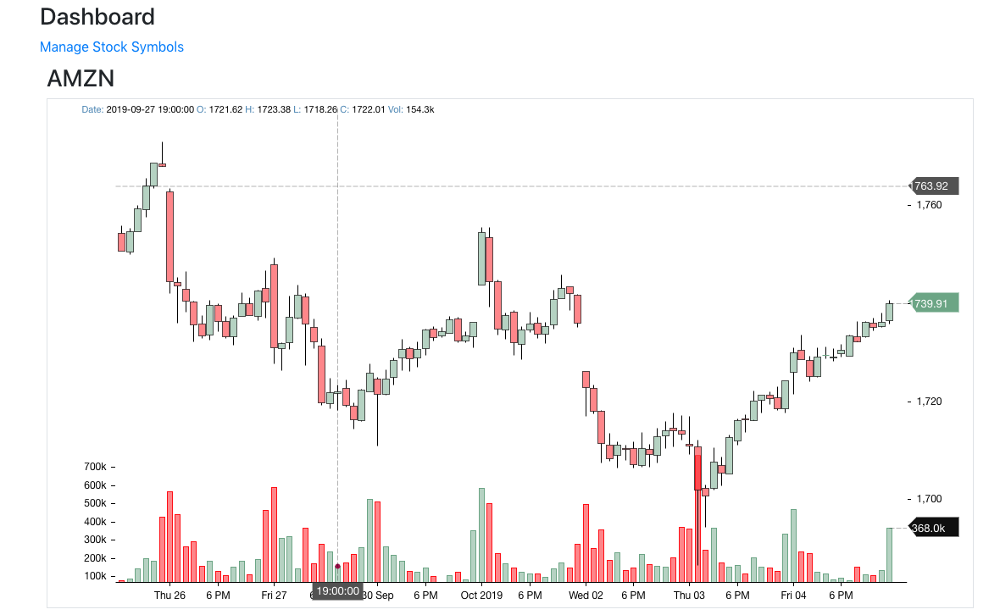

# Stock Monitoring Dashboard

## Components

This demo application consists of the following components:

* The frontend is built using React JS
* The backend is using AWS AppSync via AWS Amplify Framework
* Authentication is done via Amazon Cognito
* AWS Secrets Manager is used to store the API Keys that will be used to query the data feed.
* AWS Lambda and Amazon CloudWatch Events are used to regularly fetch the latest Intraday prices from the data feed.
* The data feed that this demo uses is from [Alpha Vantage](https://alphavantage.co)

## High-Level Architecture


# Local Installation

## Install the [AWS Amplify Framework CLI](https://aws-amplify.github.io/docs/)

```bash
npm install -g @aws-amplify/cli
```

## Clone the repo from [Github](https://github.com/jmgtan/stock_dashboard)

```bash
git clone git@github.com:jmgtan/stock_dashboard.git
```

## Once the repo has been cloned, we can then initialize the amplify project by connecting it to your AWS account.

```bash
amplify env add
```

Use the following values:

* Do you want to use an existing environment? No
* Enter a name for the environment. You can just input "local"
* Do you want to use an AWS profile? If you have a profile configured via the AWS CLI, you can reuse the same profile, otherwise choose No and configure accordingly.

## Once the initial bootstrapping has been completed, you can then start creating the resources that is related to our application.

```bash
amplify push
```

Just use the default answers and follow the instructions.

The push commands will create the following:
* Cognito User Pool
* DynamoDB
* AppSync API

# Deploy Application using Amplify Console

Go to the AWS Management Console and then Amplify. Click "Get Started" under "Deploy", see following screenshot:


You should be able to see a screen like the following:



Either "fork" from the GitHub repository, or clone and then push to your own repository. Once your repo has been selected, Amplify should automatically generate a build configuration. Make sure to select "Create new environment":



Also create a new [Service Role](https://docs.aws.amazon.com/amplify/latest/userguide/how-to-service-role-amplify-console.html) and then click "Next", confirm and then deploy. This will automatically deploy both frontend and backend. You can keep track of the deployment process by drilling down and see the logs that are being streamed in.

# Setup the Data Feed Integration

Open the file `src/aws-exports.js` and take note of the value of `aws_user_pools_id`. We will be using this to create a new app client for the Cognito User Pool.

## Register for an API Key from the Data Feed Provider

Go to [Alpha Vantage](https://www.alphavantage.co), and get a free API key.

## Create Cognito User Pool Client for the Backend

```bash
aws cognito-idp create-user-pool-client --user-pool-id <value of user pool id> --client-name BackendClient --explicit-auth-flows "ADMIN_NO_SRP_AUTH"
```

Take note of the return payload, specifically the `ClientId`.

## Create Backend User

We're going to create a new user in the user pool specifically for the use of the backend Lambda function to be able to call the AppSync mutation APIs.

```bash
aws cognito-idp admin-create-user --user-pool-id <value of user pool id> --username "<email of new admin user>" --user-attributes=Name=email,Value="<email of new admin user>" --message-action "SUPPRESS"

aws cognito-idp admin-set-user-password --user-pool-id eu-west-1_qqHO7Lr1S --username "<email of new admin user>" --password "<password>" --permanent
```

Remember the email and password for the admin user, the next step is to store these values in AWS Secrets Manager for the backend Lambda function to consume.

## Create Secrets Manager Entries

Create entry for the backend user account

```bash
aws secretsmanager create-secret --name "stockMonitoring/<env>/backend" --secret-string '{"username": "<backend username>", "password": "<backend password>"}'
```

Create entry for the data feed API key

```bash
aws secretsmanager create-secret --name "stockMonitoringDashboard/<env>/datafeed" --secret-string '{"feed_api_key": "<feed api key>"}'
```

## Configure the Backend Lambda

Open the file `processors/GetIntradayPrices/config-exports.js`

Update the following values:

* `cognito_pool_id`: use the value from the file `src/aws-exports.js` in the `aws_user_pools_id` variable
* `cognito_backend_client_id`: use the value from the `ClientId` of the backend client that was created in the previous section.
* `cognito_backend_access_key`: value is `stockMonitoring/<env>/backend`
* `appsync_endpoint_url`: use the value from the file `src/aws-exports.js` in the `aws_appsync_graphqlEndpoint` variable
* `appsync_region`: use the value from the file `src/aws-exports.js` in the `aws_appsync_region` variable
* `data_feed_key`: value is `stockMonitoring/<env>/datafeed`

## Deploy via CloudFormation

Create S3 bucket to serve as the staging area for deploying the Lambda function. This will be used by the AWS CloudFormation package command.

```bash
aws s3api create-bucket --bucket <staging bucket name> --create-bucket-configuration LocationConstraint=eu-west-1
```

Next we should install the dependencies that the function requires, do the following:

```bash
cd processors/GetIntradayPrices
npm install
```

Next we package and stage the Lambda function

```bash
cd ..
aws cloudformation package --template-file cf-template.yaml --s3-bucket <staging bucket name> --output-template-file packaged-template.yaml
```

Once the command succeeds you can then execute the deploy command

```bash
aws cloudformation deploy --template-file packaged-template.yaml --stack-name <stack name> --capabilities CAPABILITY_IAM
```

Once deployment completes, going to the CloudFormation console and into the stack, you should be able to see the list of resources that were created


Clicking the Lambda function, you should be able to see the trigger, which is a CloudWatch scheduled event for every 30 mins.


# Testing

If you deployed the application locally, you can start the server using the following command

```bash
npm start
```

This command would automatically open the browser. If this is your first time accessing the application, you should create a new account and validate it. Once you're logged in you can start adding stock symbols to monitor. See the following screenshot:



You can then either wait for the Lambda function to trigger to start populating the data, or you can manually trigger. See the following screenshots on how to manually trigger:

Go to the console and look for the Lambda function that was created by the CloudFormation template, click test:



The Lambda function doesn't really need any payload, so you can just pass in an empty JSON document



Once the test event has been created, you can click the Test button again and it should trigger the function. If you have the application open in the browser, you should be able to see the data streaming in via the chart that are automatically updated. For example:

